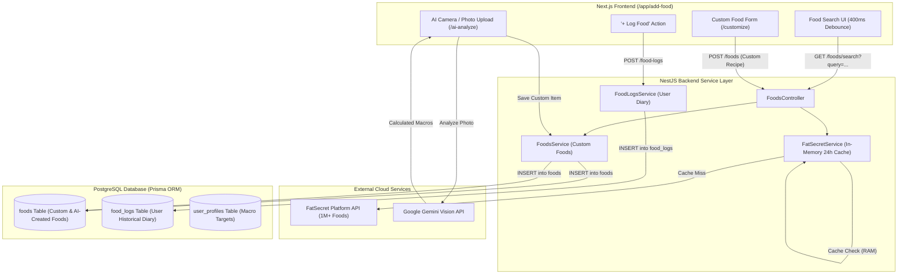

# Architecture & Caching Strategy Decision: In-Memory vs. Database

## 1. Executive Summary
This document records the architectural decision for caching and data storage in the **CalPal Application** (**Next.js + NestJS + Prisma + PostgreSQL + FatSecret Platform API**).

To maximize performance, comply with third-party Terms of Service (ToS), and keep PostgreSQL operations clean and performant, the system adopts a **Dual-Layer Hybrid Strategy**:
- **Layer 1 (Ephemeral Cache - Server RAM)**: Used for FatSecret OAuth tokens, food searches, and food nutritional detail lookups with an automatic 24-hour Time-to-Live (TTL).
- **Layer 2 (Persistent Storage - PostgreSQL Database)**: Used for User Accounts, Profiles, Custom Homemade Foods, AI-Analyzed Food items, and Historical Meal Diary Logs (`food_logs`).

---

## 2. In-Memory vs. PostgreSQL Database Caching Matrix

| Evaluation Criteria | ⚡ In-Memory (Node.js RAM) | 🗄️ PostgreSQL Database Table |
| :--- | :--- | :--- |
| **Response Latency** | 🚀 **~0.01 ms** (Direct memory pointer) | 🐢 **~5 to 15 ms** (Network, query parsing, disk I/O) |
| **Database Resource Load** | 🟢 **0% DB Load** (PostgreSQL CPU unaffected) | 🔴 High write/read overhead for transient search strings |
| **Storage & Table Bloat** | ✨ **Zero Bloat** (Memory garbage collected) | 🧹 **High Bloat** (Dead tuples generated by frequent inserts/deletes) |
| **Schema Complexity** | 🟢 **Zero Migrations** (No new tables needed) | 🔴 Requires cache tables, indexes, and background delete workers |
| **Infrastructure Cost** | 🆓 **$0** (Runs in existing server process) | 🟡 Increases DB storage volume and connection pool usage |
| **ToS 24h Compliance** | ✅ **Guaranteed** by hourly memory sweep | ⚠️ Risk of retaining data >24h if cron delete jobs fail |
| **Persistence Across Restarts** | ⚠️ Resets on process restart / redeploy | 💾 Survives process restarts |

---

## 3. Key Reasons for Choosing In-Memory Caching

### 3.1 Sub-Millisecond Speed (~1,000x Faster)
Reading a cached search result from local RAM takes **0.01 milliseconds**. Querying a database requires a network round-trip, connection pooling, SQL serialization, and buffer pool checks.

### 3.2 Elimination of PostgreSQL Table Bloat
PostgreSQL uses **Multi-Version Concurrency Control (MVCC)**. When temporary search queries are constantly inserted and deleted, dead tuples accumulate rapidly until `VACUUM` runs. Keeping short-lived search terms out of PostgreSQL keeps database pages compact and query indexes lightning-fast.

### 3.3 Strict Legal Compliance (FatSecret Section 1.5)
FatSecret mandates that non-whitelisted data must not be stored past 24 hours. An in-memory cache with an automated background garbage collector provides a reliable guarantee that data naturally evaporates and never permanently leaks into persistent disk backups.

### 3.4 Clean Separation of Concerns
- **RAM**: Handles ephemeral, high-churn, disposable cache.
- **PostgreSQL**: Dedicated strictly to mission-critical, persistent application data.

---

## 4. Trade-offs of In-Memory Caching & Mitigations

### 4.1 Process Restart Volatility
* **Trade-off**: When the NestJS backend restarts or a new version is deployed, the in-memory `Map` clears.
* **Mitigation & Impact**: The first query for a given keyword after a deploy makes 1 fresh call to FatSecret to re-populate the cache. Because CalPal has a generous quota of **5,000 daily API calls**, this slight warming overhead has negligible impact.

### 4.2 Multi-Instance Scaling (Isolated Memory)
* **Trade-off**: In a horizontal multi-server setup (e.g. 3 load-balanced server instances), each server maintains its own isolated RAM. A cache miss on Server 2 will fetch from FatSecret even if Server 1 already has it cached.
* **Mitigation**: For current single-instance deployment (Render, Railway, Fly.io, VPS), this is a non-issue. When horizontal scaling is needed, the system smoothly transitions to **Redis**.

### 4.3 RAM Footprint Management
* **Trade-off**: Unbounded memory growth could lead to high RAM utilization.
* **Mitigation**: 
  - Each search result payload is small (~2–4 KB).
  - An automated **Garbage Collection timer** sweeps the cache every **60 minutes** to immediately delete expired entries (`> 24 hours`).

---

## 5. Future Scaling Roadmap: Migration to Redis

When the application scales beyond a single server instance, the in-memory `Map` can be replaced with a distributed cache (**Redis / Upstash**) with zero architectural disruption:

```
[Server Instance 1] ───┐
[Server Instance 2] ───┼───► [Shared Redis Cluster] (TTL: 86,400s)
[Server Instance 3] ───┘
```

### Trigger Criteria for Adopting Redis:
1. Backend deploys across **multiple load-balanced containers** or auto-scaling clusters.
2. Serverless execution environment (where memory does not persist across requests).
3. API call usage approaches 80% of daily quota, requiring cache sharing across all instances.

---

## 6. System Architecture & Complete Data Flow



---

## 7. Data Flow & Logic Breakdown

### Stream 1: Public Food Search (FatSecret + In-Memory Cache)
1. **User input**: User types in the search bar on `/add-food/search`.
2. **Debounce (400ms)**: Frontend delays the request to avoid firing queries on every keystroke.
3. **Cache Lookup**: NestJS checks `searchCache` in RAM.
   - **Cache Hit (< 24h)**: Returns data in `~0.01 ms` without making an external API call.
   - **Cache Miss**: Calls FatSecret API `foods.search`, stores the JSON in RAM with `expiry = Date.now() + 24h`, and returns results.

---

### Stream 2: Custom Foods & AI Photo Analysis (`foods` Table)
1. **Custom Food Creation**: When a user creates a custom dish via `/add-food/customize`, the recipe details are saved directly into the PostgreSQL `foods` table:
   - `foodId` (UUID)
   - `userId` (Owner identifier)
   - `name` (e.g. *"Mom's Homemade Lentil Soup"*)
   - `calories`, `protein`, `carbs`, `fat`, `servingSize`, `servingUnit`
   - `isCustom = true`
2. **AI Photo Analysis**: When a user snaps a food photo via `/add-food/ai-analyze`, Gemini AI estimates the nutrition, presents the editable values to the user, and upon confirmation, saves it into the `foods` table.

---

### Stream 3: Historical Meal Diary Logging (`food_logs` Table)
When a user clicks **"Log to Breakfast / Lunch / Dinner"**, a record is committed to PostgreSQL `food_logs`:
- **For FatSecret items**: Stores `userId`, `externalFoodId`, `servingId`, `quantity`, `mealType`, and `date`.
- **For Custom / AI items**: Stores `userId`, `foodId` (foreign key to `foods`), `quantity`, `mealType`, and `date`.

This architecture ensures high performance, 100% legal compliance, zero database bloat, and offline reliability for user history.
